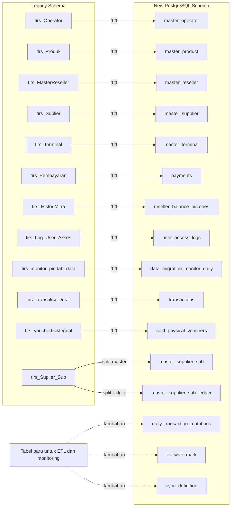

# Gambaran Tabel Legacy dan Tabel Baru

Dokumen ini merangkum pemetaan tabel dari skema legacy Mochan ke skema baru PostgreSQL berdasarkan:

- `ERD/legacy-isat/mochan.dbml`
- `ERD/sakalaguna/mochan.dbml`
- `DDL/sakalaguna/mochan.sql`

## Ringkasan

Sebagian besar tabel legacy dipindahkan secara `1:1` ke tabel baru dengan penyesuaian berikut:

- Nama tabel diubah ke format `snake_case`.
- Nama kolom diubah dari gaya legacy ke nama bisnis yang lebih eksplisit.
- Banyak field status flag lama (`'0'/'1'`, `VARCHAR(1)`, `INT`) diubah menjadi `BOOLEAN`.
- Banyak nilai uang yang dulu `FLOAT` diubah menjadi `NUMERIC(19,4)`.
- Hampir semua tabel baru menambahkan kolom audit seperti `created_at`, `updated_at`, `updated_by`, dan `deleted_at`.
- Ada tabel baru yang khusus untuk ETL dan sinkronisasi yang tidak ada di skema legacy.

## Mapping Tabel

| Legacy | Tabel Baru | Bentuk Migrasi | Catatan |
|---|---|---|---|
| `tirs_Operator` | `master_operator` | 1:1 | Nama kolom dirapikan, flag partisi menjadi boolean, ditambah kolom audit. |
| `tirs_Produk` | `master_product` | 1:1 | `KodeProduk` tetap jadi identitas bisnis, jam availability diubah menjadi tipe `TIME`, flag stok/gangguan menjadi boolean. |
| `tirs_MasterReseller` | `master_reseller` | 1:1 | ID teknis dipisah dari kode bisnis: `reseller_id` dan `reseller_code`. Ditambah relasi self-reference untuk upline. |
| `tirs_Suplier` | `master_supplier` | 1:1 | Nama kolom dibersihkan dan ditambah flag aktif serta kolom audit. |
| `tirs_Terminal` | `master_terminal` | 1:1 | `idsuplier` menjadi `supplier_id`, log terakhir jadi `last_log_at`, status aktif jadi boolean. |
| `tirs_Pembayaran` | `payments` | 1:1 | Struktur pembayaran dinormalisasi; `IDRESELLER` legacy yang string menjadi relasi `reseller_id` bigint. |
| `tirs_HistoriMitra` | `reseller_balance_histories` | 1:1 | Nama kolom lebih deskriptif; saldo menjadi `amount` dan `remaining_balance`. |
| `tirs_Log_User_Akses` | `user_access_logs` | 1:1 | `IdUser` legacy dipetakan ke `user_id` bertipe string/UUID-friendly. |
| `tirs_monitor_pindah_data` | `data_migration_monitor_daily` | 1:1 | Semua metrik direname agar eksplisit antara `legacy` dan `new`. |
| `tirs_Transaksi_Detail` | `transactions` | 1:1 | Kolom transaksi dipecah dan dirapikan; referensi reseller/product/terminal menjadi FK eksplisit. |
| `tirs_voucherfisikterjual` | `sold_physical_vouchers` | 1:1 | Nama kolom dibersihkan; referensi produk pindah dari `KodeProduk` ke `product_id`. |
| `tirs_Suplier_Sub` | `master_supplier_sub` + `master_supplier_sub_ledger` | 1:N / split | Tabel legacy menyimpan data sub-supplier dan banyak kolom ledger dalam satu tabel. Di skema baru dipisah: master sub-supplier dan detail ledger per tipe. |

## Diagram Visual

## Detail Perubahan Penting

### 1. Tabel yang tetap satu-ke-satu

Tabel berikut masih mewakili entitas yang sama, hanya dirapikan:

- `tirs_Operator` -> `master_operator`
- `tirs_Produk` -> `master_product`
- `tirs_MasterReseller` -> `master_reseller`
- `tirs_Suplier` -> `master_supplier`
- `tirs_Terminal` -> `master_terminal`
- `tirs_Pembayaran` -> `payments`
- `tirs_HistoriMitra` -> `reseller_balance_histories`
- `tirs_Log_User_Akses` -> `user_access_logs`
- `tirs_monitor_pindah_data` -> `data_migration_monitor_daily`
- `tirs_Transaksi_Detail` -> `transactions`
- `tirs_voucherfisikterjual` -> `sold_physical_vouchers`

Pola perubahan utamanya:

- Penamaan kolom uppercase/campuran legacy diubah ke `snake_case`.
- Nilai flag seperti `Aktif`, `IsGangguan`, `FlagTambahDownLine`, `FlagSekat` diubah ke boolean yang lebih aman dipakai aplikasi baru.
- Kolom teks tanggal/jam legacy seperti `jamstart`, `jamend`, `LogTerakhir` dinormalisasi ke tipe `TIME` atau `TIMESTAMP`.

### 2. Tabel yang dipecah

`tirs_Suplier_Sub` pada legacy berisi dua jenis informasi sekaligus:

- data master sub-supplier
- kumpulan akun ledger untuk banyak kebutuhan akuntansi

Di skema baru, struktur ini dipisah menjadi:

- `master_supplier_sub`: hanya menyimpan identitas sub-supplier
- `master_supplier_sub_ledger`: menyimpan pasangan `ledger_type` dan `ledger_id`

Manfaatnya:

- lebih fleksibel saat jenis ledger bertambah
- tidak perlu menambah kolom baru setiap ada akun ledger baru
- lebih mudah divalidasi dan di-query

### 3. Tabel baru yang tidak berasal langsung dari legacy bisnis

Tabel berikut muncul di skema baru untuk mendukung operasional migrasi dan sinkronisasi:

- `daily_transaction_mutations`
- `etl_watermark`
- `sync_definition`

Artinya, tabel ini bukan sekadar rename dari tabel lama, tetapi tambahan untuk kebutuhan ETL, monitoring, dan proses integrasi.

## Contoh Mapping Singkat Kolom

### `tirs_Operator` -> `master_operator`

| Legacy | Baru |
|---|---|
| `IDOPERATOR` | `operator_id` |
| `NAMAOPERATOR` | `operator_name` |
| `FlagSekat` | `is_partitioned` |
| `sekatCluster` | `partition_cluster` |
| - | `is_active`, `created_at`, `updated_at`, `updated_by`, `deleted_at` |

### `tirs_Produk` -> `master_product`

| Legacy | Baru |
|---|---|
| `IDPRODUK` | `product_id` |
| `IDOPERATOR` | `operator_id` |
| `NAMAPRODUK` | `product_name` |
| `Nominal` | `nominal_value` |
| `KodeProduk` | `product_code` |
| `JenisProduk` | `product_type` |
| `IsStokKosong` | `is_out_of_stock` |
| `IsGangguan` | `is_disrupted` |
| `jamstart` | `available_start_time` |
| `jamend` | `available_end_time` |
| `keterangan` | `notes` |

### `tirs_Suplier_Sub` -> `master_supplier_sub` + `master_supplier_sub_ledger`

| Legacy | Baru |
|---|---|
| `IdSubSuplier` | `master_supplier_sub.id_sub_supplier` |
| `NamaSubSuplier` | `master_supplier_sub.nama_sub_supplier` |
| `IdSuplier` | `master_supplier_sub.id_supplier` |
| `FormatNoAlokasi` | `master_supplier_sub.format_no_alokasi` |
| `Flag_PPOB` | `master_supplier_sub.flag_ppob` |
| `LedgerID_Debet` | `master_supplier_sub_ledger` dengan `ledger_type` tertentu |
| `LedgerID_Credit` | `master_supplier_sub_ledger` dengan `ledger_type` tertentu |
| `LedgerID_VAT` | `master_supplier_sub_ledger` dengan `ledger_type` tertentu |
| `LedgerID_PrepaidTax` | `master_supplier_sub_ledger` dengan `ledger_type` tertentu |
| kolom ledger lainnya | `master_supplier_sub_ledger` |

## Kesimpulan

Kalau disederhanakan:

- tabel lama bisnis mayoritas tetap ada padanannya di tabel baru
- struktur baru lebih rapi, lebih relasional, dan lebih siap untuk audit serta integrasi
- perubahan terbesar ada pada standardisasi nama, tipe data, audit column, dan pemecahan `tirs_Suplier_Sub`
- ada tabel baru khusus ETL yang memang tidak punya padanan langsung di legacy